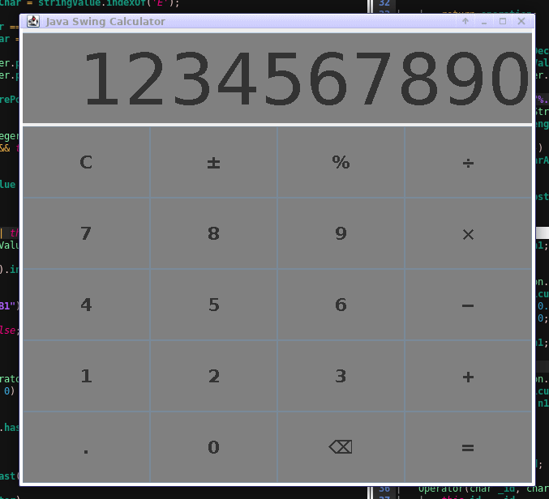

# Java swing calculator
###### Written on *Java 11*

There are no what say about, it is a calculator; no, I did not see none tutorial
about this before make this project, this fact make me happy :D

### Features

* Operators:
	* [+] Addition
	* [-] Subtraction
	* [\*] Multiplication
	* [/] Division
	* [%] Percentage calculation
	* [\^] Exponentiation
* Support:
	* Negative values
	* Floating-point numbers
* Smart resize (minimum 220x230)
* Delete values (one or all)
* Operators priority (from left to right):
	1. Percentage calculation and exponentiation
	2. Multiplication and division
	3. Addition and subtraction

---

---

---

> Sorry for bad quality video/gif.